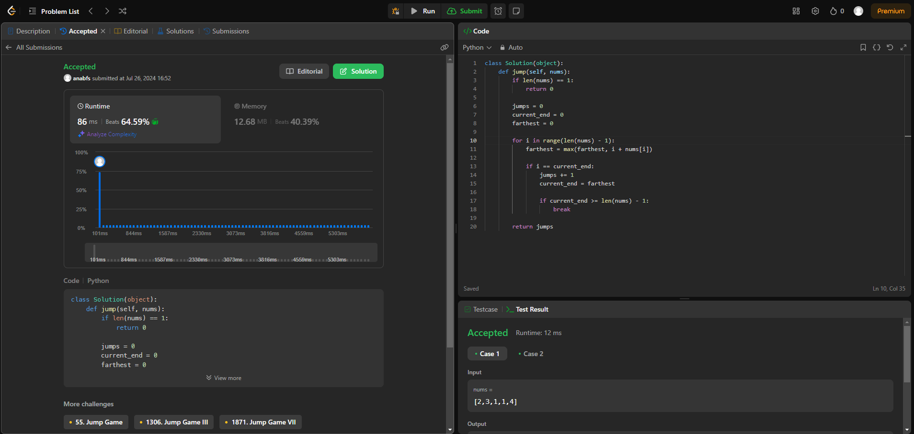

# Grafos 2 - Online Judge

**Número da Lista**: 21 
**Conteúdo da Disciplina**: Grafos2 

## Alunos

|Matrícula | Aluno |
| -- | -- |
| 18/0097181  |  Ana Beatriz Santos |

## Sobre

Repositório com resoluções de problemas de grafos do [LeetCode](https://leetcode.com/).

## Apresentação

## Screenshots

### Exercício 1 - Jump Game II

Dificuldade: Médio  
Link: [Jump Game II](https://leetcode.com/problems/jump-game-ii/description/) 
Solução: [Código](assets/codes/jumpii.py) 
O problema requer encontrar o número mínimo de saltos para alcançar o último índice de um array, dado que cada elemento do array indica o máximo de posições que você pode saltar para frente a partir desse índice. Para resolver este problema, usamos algoritmos ambiciosos.

## Instalação

**Linguagem**: Python 
Você precisará apenas criar uma conta no [LeetCode](https://leetcode.com/).

## Uso

Para executar o trabalho basta abrir o link do exercício e copiar e colar o código.
